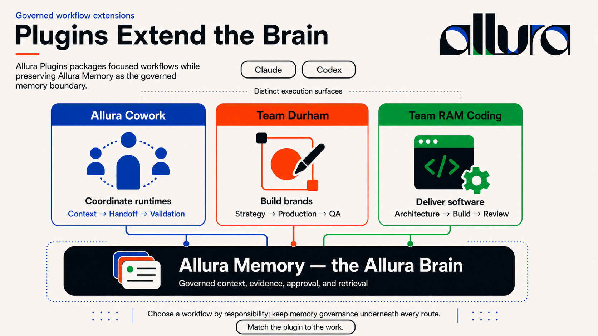

<p align="center">
  
</p>

<h1 align="center">Allura Plugins</h1>

<p align="center">
  <strong>Governed agent teams for coordination, brand production, and software delivery.</strong><br/>
   One organization-owned catalog for Claude, Codex, and Hermes plugin packages, model policy, and validation tooling.
</p>

<p align="center">
  <a href="#catalog">Catalog</a> ·
  <a href="#installation">Installation</a> ·
  <a href="#how-the-plugins-fit-together">Architecture</a> ·
  <a href="#model-governance">Model governance</a> ·
  <a href="#validation">Validation</a> ·
  <a href="#repository-map">Repository map</a>
</p>

---

<p align="center">
  <a href="docs/images/infographic-plugin-system-v3.png"></a><br/>
  <sub><a href="docs/images/infographic-plugin-system-v3.png">Open the full-size infographic</a></sub>
</p>

## What this repository owns

`allura-plugins` is the **distribution catalog and release-governance repository** for the Allura plugin layer. Standalone repositories own Team RAM, Team Durham, Mortagate, and Allura Memory source. This catalog has three jobs:

1. **Generated plugin catalog** — publish pinned exports and preserve consumer-facing install aliases without becoming their source authority.
2. **Model governance** — map agents to primary models, runtime aliases, and fallback chains in one registry.
3. **Release evidence** — prove source SHAs, export drift, manifests, commands, examples, hooks, evals, secret scans, and runtime-specific package checks before a plugin is treated as ready.

Machine-readable pins live in [`source-locks.json`](source-locks.json). [`harness-sync.sh`](harness-sync.sh) only moves content from a public standalone repository at its locked full SHA into a generated catalog destination. Generated package files are not authoritative and must not be edited manually.

Plugins add skills, commands, and operating roles. They do not replace Allura Brain or bypass its memory governance.

## Catalog

The Claude marketplace contains three versioned packages. The repository also ships one Hermes-native provider and one runtime-neutral Microsoft Cowork export. Counts below are generated/source definitions measured from the current repository tree; they are not counts of agents currently installed, loaded, or running.

| Plugin | Release metadata | Agent definitions | Command definitions | Skill definitions | Purpose |
|---|:---:|---:|---:|---:|---|
| [Allura Cowork](allura-cowork/README.md) | 0.2.0 | 1 | 4 | 1 | Coordinate Claude and Codex with hydration, honest attribution, evidence, handoff, and closeout |
| [Team Durham](team-durham/README.md) | 0.3.0 | 13* | 22 | 77 | Generated export for brand strategy, visual production, accessibility, and QA |
| [Team RAM Coding](team-ram-coding/README.md) | 0.4.2 runtime / 0.4.0 npm | 11 | 34 | 163 | Generated export for Brooks-led architecture, recon, implementation, review, and validation |
| [Hermes Allura Brain](plugins/hermes-allura-brain/README.md) | 0.2.0 | — | 1 | — | Hermes-native governed recall and outcome persistence provider |
| [Mortagate Cowork](packages/mortagate-cowork/README.md) | 0.1.0 | — | — | 4 | Pinned 19-file Microsoft Cowork package export; not a Claude/Codex marketplace plugin |

Team Durham's marketplace, Claude, Codex, and npm versions are `0.3.0`. Team RAM deliberately preserves the marketplace alias `team-ram-coding` while the generated source-owned manifests remain named `team-ram-harness`; marketplace/Claude/Codex runtime metadata is `0.4.2`, while the source npm package is independently versioned at `0.4.0`. CI validates those locked identities instead of hand-editing generated source manifests.

\* Team Durham exports 13 loadable agent definitions: 12 canonical roles plus the deliberate `openagent` runtime compatibility fallback. This is not a claim that 13 agents are installed or running.

Mortagate Cowork targets Microsoft Cowork's app-package and Agent Skills contract. It is linked from this runtime-neutral catalog README but is intentionally absent from the Claude marketplace and Codex marketplace shell.

Hermes Allura Brain is a Hermes-native provider declared by `plugins/hermes-allura-brain/plugin.yaml`; it is intentionally not listed in the Claude marketplace because it does not implement the Claude/Codex package-manifest contract.

The `allura/` directory is a local Codex README asset and guidance pack. It is not listed as a public Claude marketplace package and still contains manifest placeholders; treat it as internal support material until those fields are resolved.

### Allura Cowork

Use Allura Cowork when a task crosses Claude and Codex or needs a durable runtime handoff.

```text
Hydrate project + Brain
    ↓
Name the active runtime
    ↓
Route work and define evidence
    ↓
Create/validate handoff
    ↓
Close with outcome + remaining risk
```

Its core promise is runtime honesty: adopting a named perspective is not the same as executing a real second runtime or subagent.

### Team Durham

Team Durham is the brand-production system. Its canonical route is:

```text
Brief → strategy → positioning → verbal identity
      → visual direction → production → accessibility → QA
```

The agent roster covers orchestration, strategy, copy, visual direction, brand systems, evidence, QA, and operational trust. Optional integrations support Figma, Penpot, image generation, Notion, and document production.

### Team RAM Coding

Team RAM Coding is the governed software-delivery system. Brooks owns conceptual integrity and routing; Scout loads context; Woz implements; Pike and Fowler review interfaces and change safety.

```text
Brooks → Scout → Allura Brain → required skills
       → build/review → validate → log
```

The plugin includes task management, code review, multi-source research, MCP orchestration, security policy, secret-handling, and multi-agent dispatch skills.

## How the plugins fit together

### Source ownership

| Capability | Standalone source authority | Catalog role |
|---|---|---|
| Engineering agent harness | [Allura Team RAM](https://github.com/Allura-Ecosystem/allura-team-ram) | Generated `team-ram-coding/` distribution with a compatibility install alias |
| Brand-production harness | [Team Durham](https://github.com/Allura-Ecosystem/team-durham) | Generated `team-durham/` distribution |
| Mortgage evidence-review Cowork package | [Mortagate](https://github.com/Allura-Ecosystem/mortagate) | Generated runtime-neutral `packages/mortagate-cowork/` distribution |
| Governed memory | [Allura Memory](https://github.com/Allura-Ecosystem/Allura_Memory) | Linked dependency/provider surfaces; its source is not owned here |

The standalone repositories own content, contracts, and release exporters. This repository owns source locks, generated distribution paths, marketplace compatibility identities, catalog-level policy, and release verification.

| Need | Lead plugin | Supporting plugin |
|---|---|---|
| Cross-runtime collaboration | Allura Cowork | Team RAM Coding or Team Durham executes the domain work |
| Product or engineering work | Team RAM Coding | Cowork handles runtime handoff |
| Brand strategy and production | Team Durham | Cowork handles runtime handoff |
| Persistent project context | Allura Brain connection | Every plugin follows the same scoped memory rules |

The plugins are composable but keep distinct ownership:

- **Cowork coordinates.**
- **Durham creates and protects brand intent.**
- **Team RAM Coding builds and validates software.**
- **Allura Brain remembers and governs.**
- **Hermes Allura Brain connects Hermes to governed recall and outcome persistence.**

## Shared operating contract

All catalog plugins inherit the same Allura expectations:

- search relevant project context before substantive work;
- use `group_id: allura-system` unless the project declares another valid `allura-*` tenant;
- treat raw episodic traces as evidence, not canonical truth;
- identify the actual runtime and never claim an agent or tool executed when it did not;
- preserve approval boundaries for secrets, production, scheduling, promotion, and destructive actions;
- validate the result before calling work done;
- write a factual outcome receipt after substantive work when Allura Brain is available.

## Installation

### Claude marketplace

```text
/plugin marketplace add Allura-Ecosystem/allura-plugins
/plugin install allura-cowork@allura-ecosystem
/plugin install team-durham@allura-ecosystem
/plugin install team-ram-coding@allura-ecosystem
```

The Claude catalog is defined in [`.claude-plugin/marketplace.json`](.claude-plugin/marketplace.json). Each package also owns its own `.claude-plugin/plugin.json`. Hermes uses its native provider manifest instead; follow [its package README](plugins/hermes-allura-brain/README.md).

### Codex

Each catalog package contains a `.codex-plugin/plugin.json` manifest. The repository does not itself prove that a given Codex build accepts, installs, or loads every declared surface. For a compatible Codex environment, clone this repository into your plugin source location, register the package through that environment's supported local-plugin flow, and verify it appears after restart.

The root [`.agents/plugins/marketplace.json`](.agents/plugins/marketplace.json) is currently an empty index shell (`plugins: []`), not evidence that these packages are registered in Codex.

### Requirements

| Requirement | Applies to |
|---|---|
| A compatible Claude Code or Codex plugin environment | Targeted by the package manifests; verify loading in the actual runtime |
| Allura Brain MCP connection | Expected for governed hydration and outcome logging |
| Python 3 | Allura Cowork hooks and validation scripts |
| Docker | Optional MCP Docker, secret, and infrastructure workflows |
| Figma, Penpot, Notion, fal.ai, LibreOffice | Optional Team Durham integrations only |

Missing optional integrations should degrade visibly and leave the core plugin loadable.

## Updating runtimes

Preview changes before applying them:

```bash
bash scripts/plugins-update-all.sh --dry-run
```

Run the helper's non-dry-run update attempts on detected surfaces:

```bash
bash scripts/plugins-update-all.sh
```

Target one plugin or runtime:

```bash
bash scripts/plugins-update-all.sh team-durham
bash scripts/plugins-update-all.sh --runtime codex
```

The helper scans Claude, Codex, Hermes, and OpenClaw-shaped surfaces, but behavior is asymmetric: it can sync the Claude marketplace and operate on detected Claude/Hermes/OpenClaw installations, while its Codex path currently inventories local manifest versions. It is not proof that all four runtimes support or have loaded these plugins; verify each target runtime separately.

## Model governance

[`docs/models.yaml`](docs/models.yaml) is the source of truth for agent-to-model policy. It records:

- model provider and capability tier;
- context window, cost metadata, and latency profile;
- runtime availability and aliases;
- each agent's primary model and fallback chain;
- canary, evaluation, deprecation, and rollback policy.

The registry contains model-policy and alias entries for multiple runtime names. Those entries describe intended routing where a runtime integration exists; they do not establish installation, feature parity, or successful execution on Claude, OpenCode, Codex, Hermes, or OpenClaw.

### Model workflow

```text
Edit models.yaml
    ↓
Dry-run frontmatter sync
    ↓
Run evaluation fixtures
    ↓
Canary the candidate model
    ↓
Promote or roll back with evidence
```

Commands:

```bash
bash scripts/models-update-all.sh --dry-run
bash scripts/models-eval.sh
bash scripts/models-performance.sh
```

Do not hand-edit scattered agent model fields and then treat them as policy. Update the registry first, inspect the dry run, and sync deliberately.

## Validation

### Catalog checks

| Command | What it checks |
|---|---|
| `bash scripts/commands-audit.sh` | Orphan commands, manifest format, frontmatter, and cross-plugin collisions |
| `bash scripts/models-update-all.sh --dry-run` | Model assignment drift without mutation |
| `bash scripts/models-eval.sh` | CLASSIC evaluation fixtures |
| `bash scripts/plugins-update-all.sh --dry-run` | Cross-runtime version/update impact |
| `./harness-sync.sh --check` | Public source commit availability, deterministic regeneration, provenance, versions, aliases, forbidden files, and byte/hash drift |
| `gitleaks detect --no-git --source . --config .gitleaks.toml` | Generated-output and catalog secret scan |

CI runs the source-export verifier, manifest validator, command audit, JSON/YAML/shell parsing, gitleaks, and package smoke checks. Model-evaluation and runtime-update helpers remain operator-run because they can create evidence or depend on locally installed runtimes.

### Current CI coverage

The [`.github/workflows/ci.yml`](.github/workflows/ci.yml) checks:

- every locked public source commit can be cloned and regenerated through its canonical exporter/contract with no catalog drift;
- provenance, allowlists, per-file hashes, generated-file inventories, runtime distinctions, compatibility aliases, and applicable version parity;
- the Claude marketplace parses and each listed source resolves inside the repository;
- the Hermes-native `plugins/hermes-allura-brain/plugin.yaml` declares a valid `allura-brain` provider identity, version, and description;
- Claude marketplace versions match the corresponding Claude `plugin.json` versions;
- explicitly listed Claude agent paths and all declared Claude command paths exist; list-valued agent manifests and top-level command directories have no on-disk orphans, and nested command definitions are rejected;
- shipped marketplace plugin directories do not contain the workflow's machine-path patterns or prohibited embedded runtime-config directories;
- repository JSON parses, YAML loads, and shell scripts pass `bash -n`;
- the root README and LICENSE exist; and
- gitleaks reports no unallowlisted findings across the entire checked-out catalog;
- command audits and package-specific Allura Cowork/Mortagate smoke checks pass.

CI cannot prove optional external integrations, native installation into every locally available runtime, or live cross-runtime behavioral parity. Those require release-environment evidence; CI does not turn a structural package check into a runtime-execution claim.

### Package checks

Allura Cowork:

```bash
python3 allura-cowork/scripts/validate_plugin.py allura-cowork
python3 allura-cowork/scripts/run_evals.py allura-cowork
```

Team Durham's validation skills and Team RAM Coding's review gates are documented in their package READMEs and skill folders. These are available validation definitions, not evidence that CI ran them. A manifest parsing successfully is necessary, but it is not sufficient evidence that every command, hook, dependency, runtime, or external integration works.

### Definition of ready

A generated plugin release is ready for catalog review only when:

1. the standalone source repository and exact public full SHA are locked;
2. its canonical manifest/contract and exporter regenerate the destination with zero drift or unexpected files;
3. generated provenance and per-file inventories required by the source contract validate;
4. Claude/Codex manifests and marketplace aliases resolve without modifying generated source identities;
5. applicable marketplace/runtime/package versions match the machine-readable lock;
6. commands, JSON, YAML, shell, package smoke, and gitleaks checks pass;
7. optional dependencies, degraded behavior, exclusions, and runtime distinctions are documented; and
8. runtime-ready claims beyond CI are backed by evidence from the actual target runtime.

## Plugin anatomy

```text
<plugin>/
├── .claude-plugin/plugin.json   Claude package manifest
├── .codex-plugin/plugin.json    Codex package manifest
├── agents/                      specialist role definitions
├── commands/                    user-invoked workflows
├── skills/                      reusable operating instructions
├── hooks/                       optional lifecycle hooks
├── scripts/                     validation and package tooling
├── evals/                       behavior fixtures
└── README.md                    package-specific contract
```

Not every package needs every directory. Keep the manifest surface as small as the product requires.

## Repository map

```text
allura-plugins/
├── .claude-plugin/marketplace.json   Claude marketplace catalog
├── .agents/plugins/marketplace.json  Codex marketplace index shell
├── allura-cowork/                    coordination and handoff plugin
├── team-durham/                      generated Team Durham distribution
├── team-ram-coding/                  generated Team RAM distribution (compatibility alias)
├── packages/mortagate-cowork/        generated Microsoft Cowork distribution (not Claude marketplace)
├── plugins/hermes-allura-brain/       Hermes-native Allura Brain provider
├── source-locks.json                  public repo/SHA/export/runtime/alias locks
├── harness-sync.sh                    pinned source -> catalog check/sync entrypoint
├── _bmad/bmm/                         catalog-local epics and stories
├── allura/                           internal README asset/guidance pack
├── docs/models.yaml                  canonical model registry
├── docs/images/                      README brand assets
├── scripts/                          update, audit, and eval tooling
└── evals/fixtures/                   shared evaluation fixtures
```

## Contributing

- Make Team RAM, Team Durham, Mortagate, and Allura Memory content changes in their standalone owning repositories, never in generated catalog exports.
- Update both Claude and Codex manifests in the standalone source when that public surface changes, then regenerate.
- Add commands explicitly rather than relying on broad globs.
- Keep secrets and credentials out of manifests, prompts, examples, and test output.
- Preserve user changes in dirty worktrees.
- Run the narrowest relevant validation first, then the catalog checks.
- Document external dependencies as optional unless the plugin cannot function without them.

## Brand system

The plugin catalog uses the canonical Allura visual language:

- Allura Blue `#0D47A1` — intelligence and coordination
- Allura Orange `#FF4D1F` — clarity and creative decision
- Allura Green `#14BA4B` — connection and delivery
- Allura Ink `#0F1720` — technical structure
- Allura Cream `#F7F3EE` — readable editorial space
- Aeonik — display, heading, and body typography
- IBM Plex Mono — code and technical identifiers

## License

MIT — see [LICENSE](LICENSE).

---

<p align="center">
  <strong>Coordinate clearly. Create deliberately. Build with evidence.</strong>
</p>
